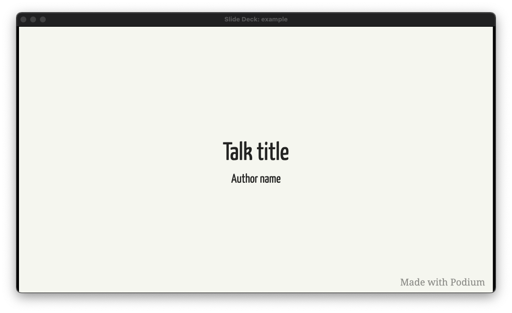
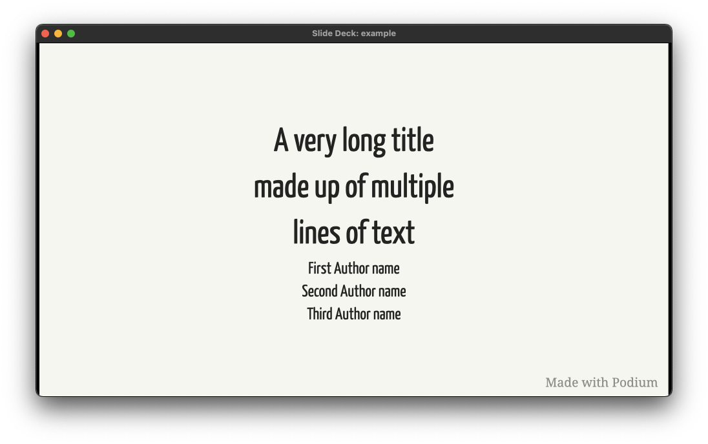
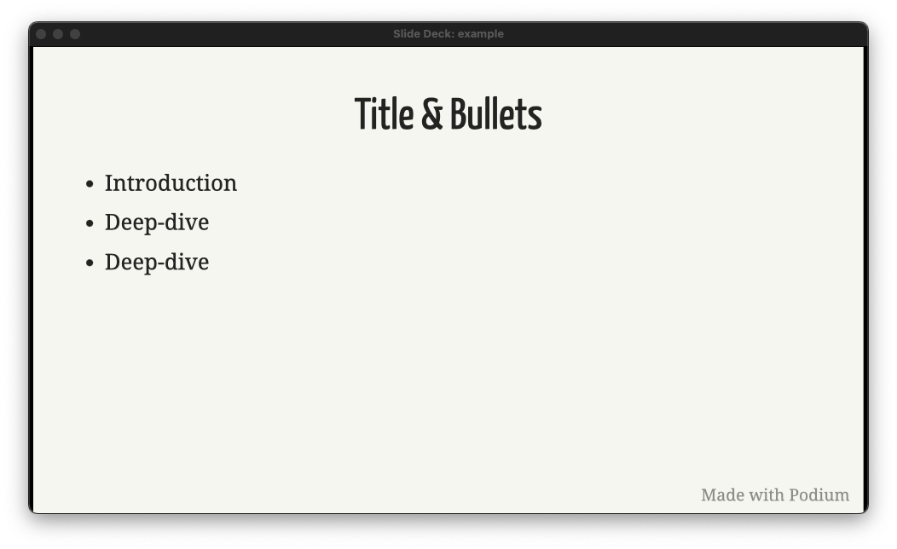
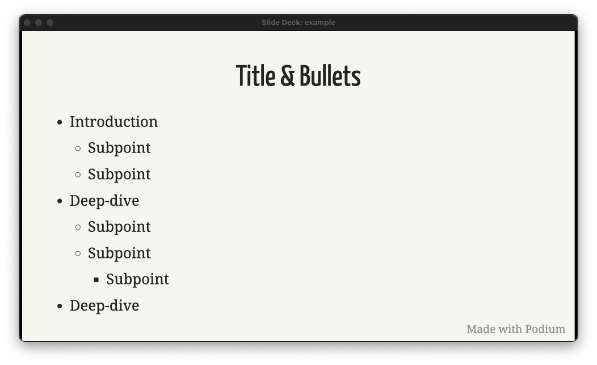
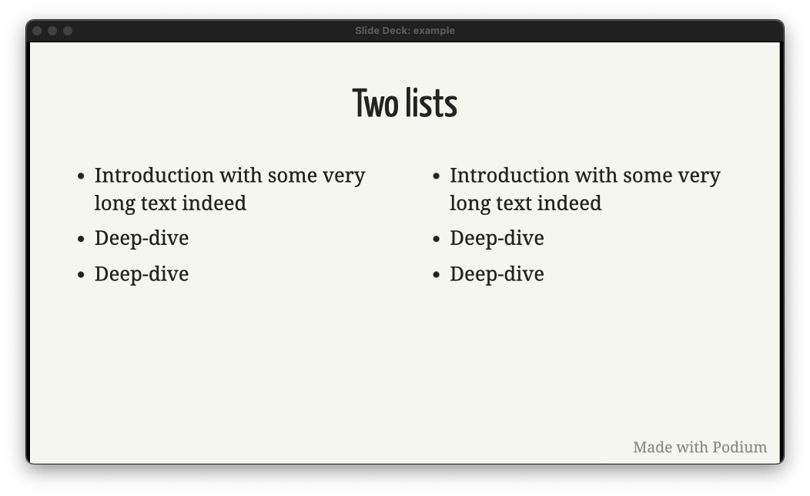
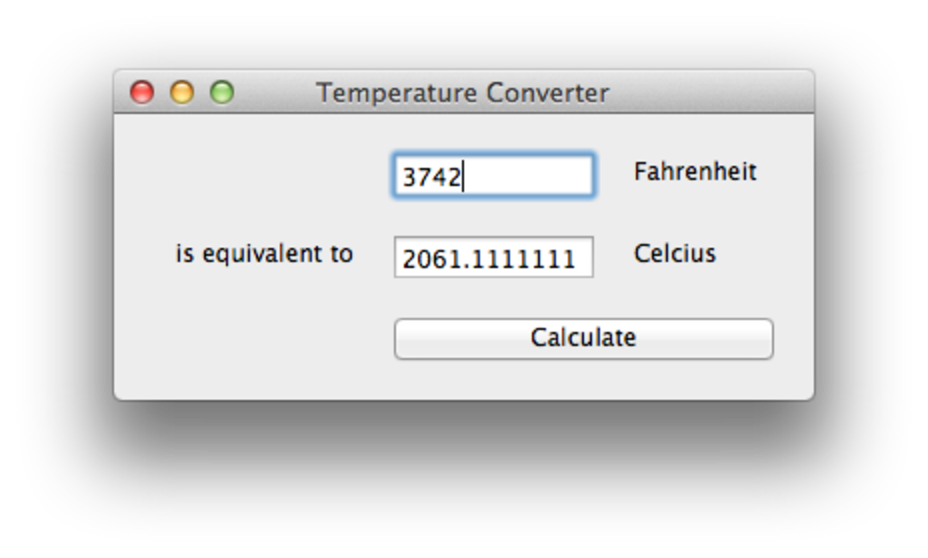
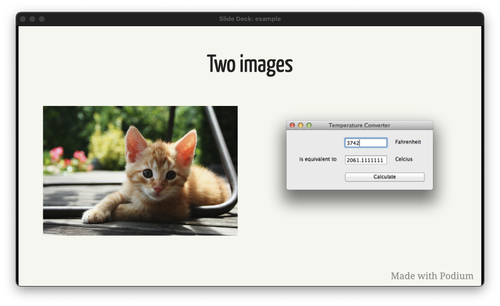

# Podium reference

TODO: Intro

## Slides and speaker notes

Your slide content is contained within a `slides.md` file, which requires some specific formatting to render as separate slides.

Each slide and associated speaker notes are separated from the next with three dashes (`---`). The speaker notes are separated from the slide content by three question marks (`???`).

A simple slide with speaker notes would be formatted as follows:

```markdown
# Slide title

???

Welcome to my talk.

---
```


Speaker notes will render Markdown syntax, and can span multiple lines and include separate paragraphs.

This basic format applies regardless of what syntax you include in the slide content.

You can also attach annotations in the form of classes. For example, centering the title and author on a title slide would include the following:

```markdown
class: title

# Talk title

## Author name
```



Other possible class annotations will be discussed alongside the relevant content below.

### Style customization

You'll find a `style.css` file within the Podium slide deck bundle. You can use this to apply style overrides to your slides.

## Markdown syntax

Basic Markdown is supported.

### Basic formatting

Text formatting includes *italics* (`*italics*`), **bold** (`**bold**`), ***bold italics*** (`***bold italics***`), and ~~strikethrough~~ (`~~strikethrough~~`). You can include links, such as `[BeeWare](https://beeware.org)`, which renders as [BeeWare](https://beeware.org).

### Title slide

A basic title slide consists of a centered title and an author name. It requires `title` class annotation. It is formatted as follows:

```markdown
class: title

# Talk title

## Author name
```


You can extend titles to multiple lines, and include multiple authors, formatted as follows:

```markdown
class: title

# A very long title

## made up of multiple

## lines of text

### First Author name

### Second Author name

### Third Author name
```



### Bullet and number slides

There are multiple ways to display content listed on a slide.

Bullets are denoted by a dash (`-`), asterisk (`*`), or plus sign (`+`) at the beginning of a line. You can indent one or more items to create a nested list.

#### Basic bullets

A slide with a simple bullet list would be formatted as follows:

```markdown
# Title & Bullets

* Introduction
* Deep-dive
* Deep-dive
```



A slide with a nested bullet list could be formatted as follows:

```markdown
# Title & Bullets

* Introduction
    * Subpoint
    * Subpoint
* Deep-dive
    * Subpoint
    * Subpoint
        * Subpoint
* Deep-dive
```



Markdown allows for mixing bullet notation in nested bullet lists, but each nested level *must* be consistent, as shown above.

### Images

You can display images on slides.

#### Columns

You can display a slide with content in two columns.

For example, two bullet lists displayed side by side would be formatted as follows:

```markdown
# Two lists

.left-column[

* Introduction with some very long text indeed
* Deep-dive
* Deep-dive

] .right-column[

* Introduction with some very long text indeed
* Deep-dive
* Deep-dive
]
```



Two images displayed side by side would be formatted as follows:

```markdown
# Two images

.left-column[


] .right-column[

 ]
```



Any valid Markdown can be displayed in either column.

### Quotation

### Code

Inline code and codeblocks are supported.

Inline code is surrounded by single backticks. The following would render as a bullet with the word "inline" in code formatting.

```markdown
* A bullet with `inline` code formatting.
```

You can include codeblocks both at the top level and in bullet lists. Codeblocks are denoted by three backticks on the lines before and after the code, with the first line including the language being rendered.

To include a Python codeblock at the top level, you could include the following in your `slides.md`:

````markdown
```python
def greeting(arg):
    if arg == 'hello':
        print('Hello World')
    else:
        print(arg)


class Something():
    def __init__(self, *args, **kwargs):
        super().__init__(*args, **kwargs)
```
````

TODO: Screenshot

To include a Python codeblock in a bullet list, you could include the following:

````markdown
* Code in a bullet:

    ```python
    def greeting(arg):
      if arg == 'hello':
          print('Hello World')
    ```
````

TODO: Screenshot

### Footnotes

### Inline content

### Animated transitions

## Keyboard shortcuts

- CMD+Shift+P - Enter presentation mode; or, if in presentation mode, pause timer
- CMD+P - Open presentation in Print view
- CMD+Q - Quit Podium (exit presentation mode)
- CMD+Tab - Switch displays
- Right/Left arrows - Next/previous slide
- Home/End - first/last slide
- CMD+A - Switch aspect ratio between 16:9 and 4:3
- CMD+R - Reload slide deck
- CMD+T - Reset timer
