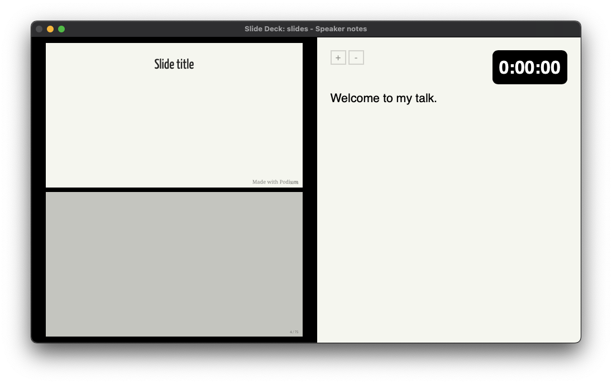

# Podium reference

TODO: Intro

## Slides and speaker notes

Your slide content is contained within a `slides.md` file, which requires some specific formatting to render as separate slides.

Each slide and associated speaker notes are separated from the next with three dashes (`---`). The speaker notes are separated from the slide content by three question marks (`???`).

A simple slide with speaker notes would be formatted as follows:

```markddown
# Slide title

???

Welcome to my talk.

---
```



This basic format applies regardless of what syntax you include in the slide content.

## Markdown syntax

Basic Markdown is supported.

### Basic formatting

Text formatting includes *italics* (`*italics*`), **bold** (`**bold**`), ***bold italics*** (`***bold italics***`), and ~~strikethrough~~ (`~~strikethrough~~`). You can include links, such as `[BeeWare](https://beeware.org)`, which renders as [BeeWare](https://beeware.org).

### Title slide

### Bullet slides

### Images

### Quotation

### Code

Inline code and codeblocks are supported.

Inline code is surrounded by single backticks. The following would render as a bullet with the word "inline" in code formatting.

```markdown
* A bullet with `inline` code formatting.
```

You can include codeblocks both at the top level and in bullet lists. Codeblocks are denoted by three backticks on the lines before and after the code, with the first line including the language being rendered.

To include a Python codeblock at the top level, you could include the following in your `slides.md`:

````markdown
```python
def greeting(arg):
    if arg == 'hello':
        print('Hello World')
    else:
        print(arg)


class Something():
    def __init__(self, *args, **kwargs):
        super().__init__(*args, **kwargs)
```
````

TODO: Screenshot

To include a Python codeblock in a bullet list, you could include the following:

````markdown
* Code in a bullet:

    ```python
    def greeting(arg):
      if arg == 'hello':
          print('Hello World')
    ```
````

TODO: Screenshot

### Footnotes

### Inline content

### Animated transitions

## Keyboard shortcuts

- CMD+Shift+P - Enter presentation mode; or, if in presentation mode, pause timer
- CMD+P - Open presentation in Print view
- CMD+Q - Quit Podium (exit presentation mode)
- CMD+Tab - Switch displays
- Right/Left arrows - Next/previous slide
- Down/Up arrows - Next/previous slide
- Enter - Next slide
- Home/End - first/last slide
- CMD+A - Switch aspect ratio between 16:9 and 4:3
- CMD+R - Reload slide deck
- CMD+T - Reset timer
