# Podium reference

TODO: Intro

## Slides and speaker notes

Your slide content is contained within a `slides.md` file, which requires some specific formatting to render as separate slides.

Each slide and associated speaker notes are separated from the next with three dashes (`---`). The speaker notes are separated from the slide content by three question marks (`???`).

A simple slide with speaker notes would be formatted as follows:

```markdown
# Slide title

???

Welcome to my talk.

---
```


Speaker notes will render Markdown syntax, and can span multiple lines and include separate paragraphs.

This basic format applies regardless of what syntax you include in the slide content.

You can also attach annotations in the form of classes. For example, centering the title and author on a title slide would include the following:

```markdown
class: title

# Talk title

## Author name
```


Other possible class annotations will be mentioned alongside the relevant content below.

### Incremental content builds

You can introduce one element at a time on your slides with incremental content builds. For example, introducing a series of basic bullets one at a time is formatted as follows:

```markdown
# Incremental presentation

* Introduce
--

* one
--

* bullet
--

* point
--

* at
--

* a
--

* time
```

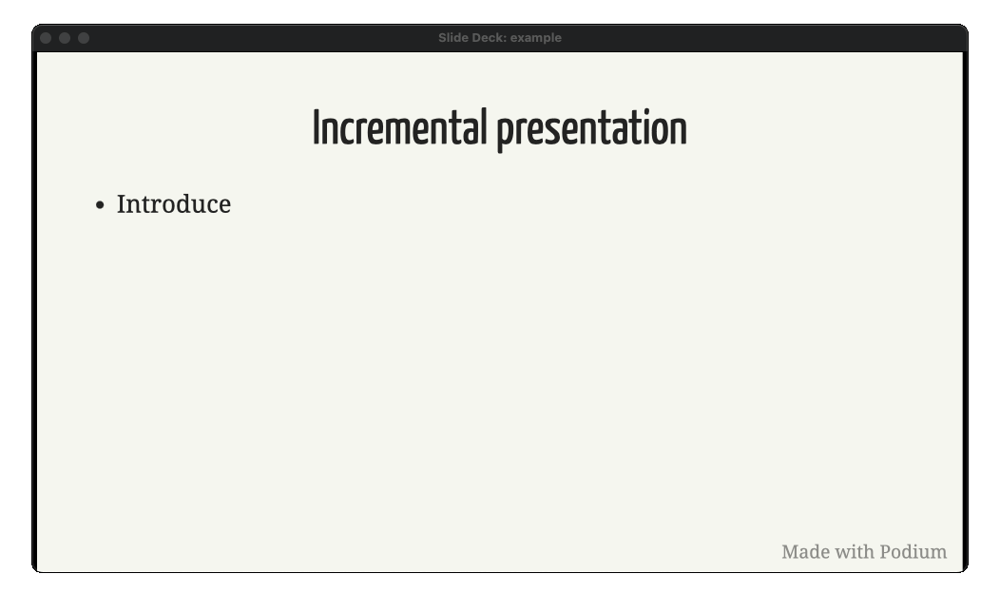

Your speaker notes must be included throughout the slide to show up at the same time as each bullet. They will not show up until the end if you put them at the end. For example, displaying your speaker notes alongside each bullet is formatted as follows:

```markdown
# Incremental presentation

* First bullet

???

First bullet notes.

--

* Second bullet

???

## Second bullet notes.
--

* Third bullet

???

Third bullet notes.
```

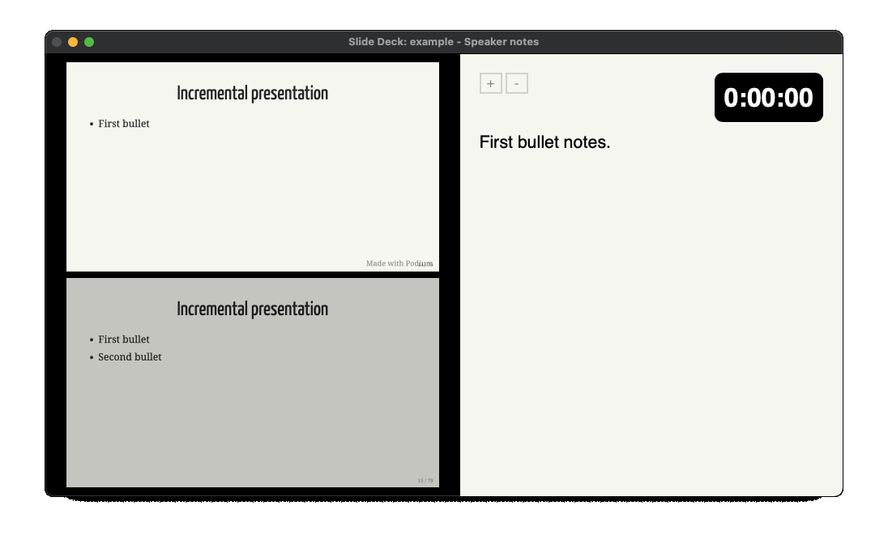

### Style customization

You'll find a `style.css` file within the Podium slide deck bundle. You can use this to apply style overrides to your slides.

TODO: elaborate here

## Markdown syntax

Basic Markdown is supported.

### Basic formatting

Text formatting includes *italics* (`*italics*`), **bold** (`**bold**`), ***bold italics*** (`***bold italics***`), and ~~strikethrough~~ (`~~strikethrough~~`). You can include links, such as `[BeeWare](https://beeware.org)`, which renders as [BeeWare](https://beeware.org).

### Title slide

A basic title slide consists of a centered title and an author name. It requires `title` class annotation. It is formatted as follows:

```markdown
class: title

# Talk title
## Author name
```


You can extend titles to multiple lines, and include multiple authors, formatted as follows:

```markdown
class: title

# A very long title
# made up of multiple
# lines of text
## First Author name
## Second Author name
## Third Author name
```


### Reverse color slide

You can make a point stand out by using a title slide with a `reverse` annotation, formatted as follows:

```markdown
class: title reverse

# Point of emphasis
```

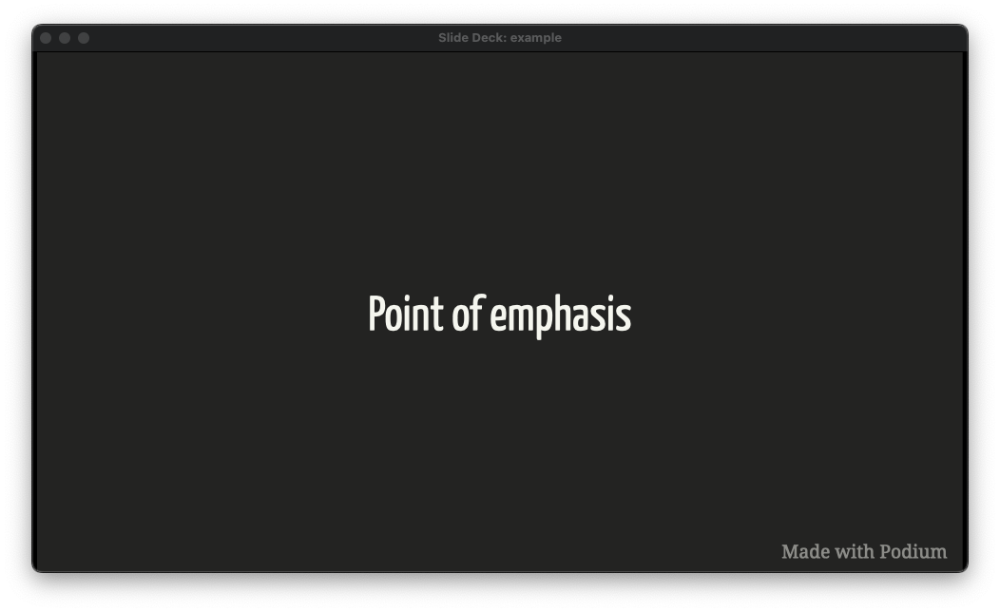

### Bullet and number slides

There are multiple ways to display content listed on a slide.

Bullets are denoted by a dash (`-`), asterisk (`*`), or plus sign (`+`) at the beginning of a line. You can indent one or more items to create a nested list.

#### Basic bullets

A slide with a simple bullet list would be formatted as follows:

```markdown
# Simple bullets

* Introduction
* Deep-dive
* Deep-dive
```

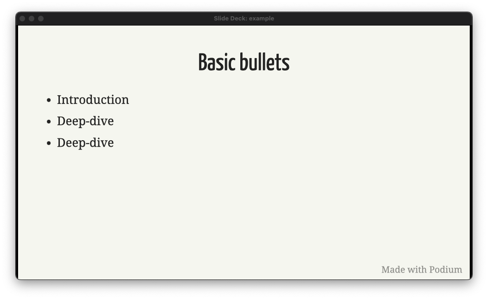

A slide with a nested bullet list could be formatted as follows:

```markdown
# Nested bullets

* Introduction
    * Subpoint
    * Subpoint
* Deep-dive
    * Subpoint
    * Subpoint
        * Subpoint
* Deep-dive
```

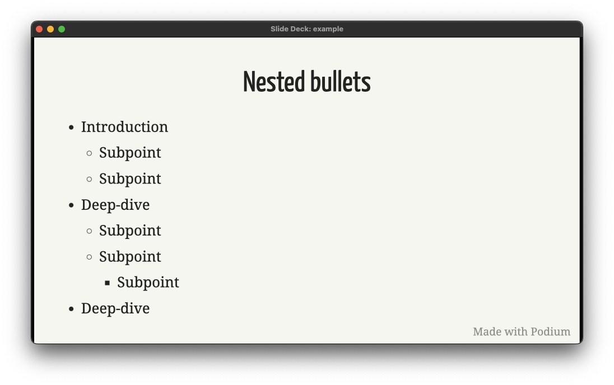

Markdown allows for mixing bullet notation in nested bullet lists, but each nested level *must* be consistent, as shown above.

#### Numbered lists

A slide with a numbered list would be formatted as follows:

```markdown
# Numbered list

1. Introduction
   1. Subpoint
   2. Subpoint
      1. Subpoint
      2. Subpoint
2. Deep-dive
3. Deep-dive
```

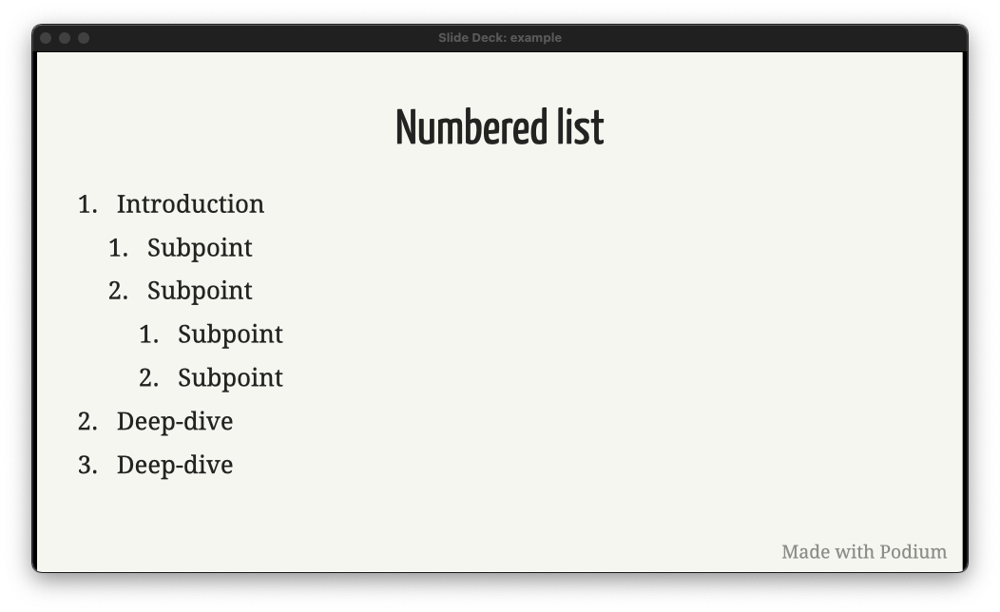

### Images

You can display images on slides using standard Markdown.

Images are formatted as follows:

```markdown

```

#### Basic images with a caption

You can include a footnote as a caption. The following would show an image of a kitten with the link to the original as a caption:

```markdown


.footnotes[ commons.wikimedia.org/wiki/File:Red_Kitten_01.jpg ]
```

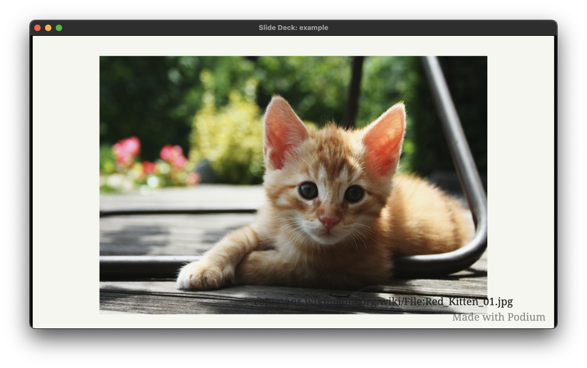

#### Screenshots

You can display a screenshot with a caption, formatted as follows:

```markdown
class: screenshot


# A screenshot
```

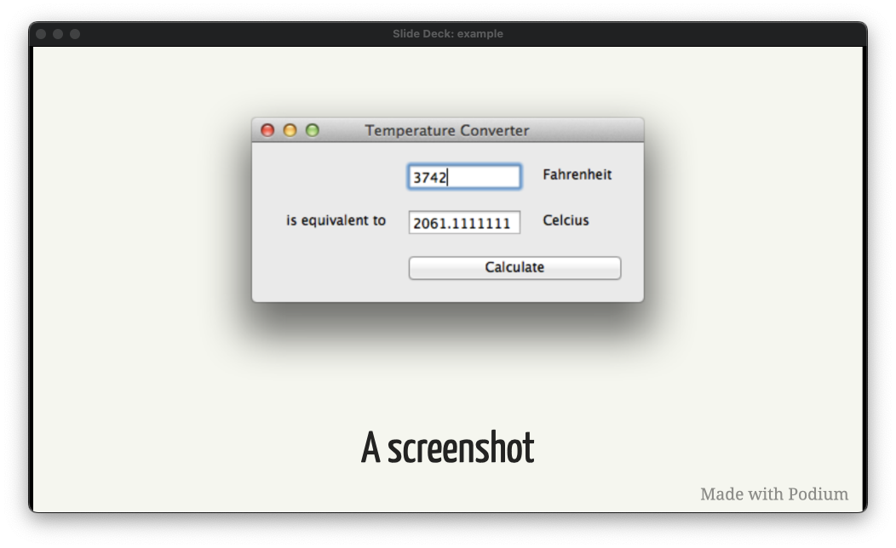

This centers the image, and makes space for the caption.

#### Logos

You can display a logo, formatted as follows:

```markdown
class: logo


```

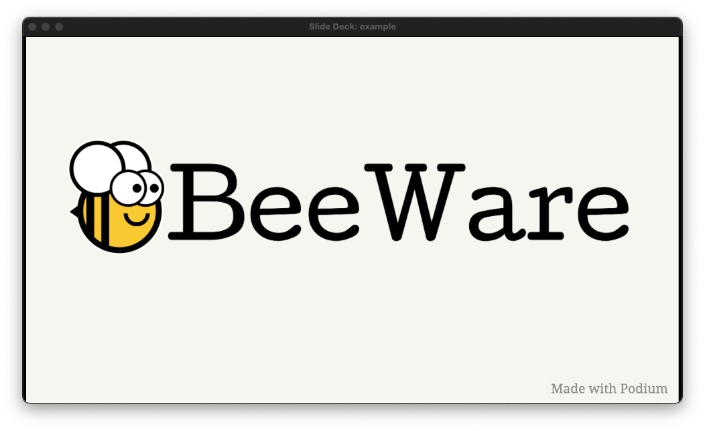

This emphasizes, and vertically centers the image.

### Columns

You can display a slide with content in two columns.

For example, two bullet lists displayed side by side would be formatted as follows:

```markdown
# Two lists

.left-column[

* Introduction with some very long text indeed
* Deep-dive
* Deep-dive

]

.right-column[

* Introduction with some very long text indeed
* Deep-dive
* Deep-dive
]
```


Two images displayed side by side would be formatted as follows:

```markdown
# Two images

.left-column[


]

.right-column[

 ]
```


Any valid Markdown can be displayed in either column.

### Quotations

You can display quotations and attribution, formatted as follows:

```markdown
# Quotation

> One thing was certain, that the white kitten had had nothing to do with it -- it was the black kitten's fault entirely. For the white kitten had been having its face washed by the old cat, for the last quarter of an hour (and bearing it pretty well, considering) so you see that it couldn't have had any hand in the mischief.

<cite>Lewis Carroll, Through the Looking Glass</cite>
```

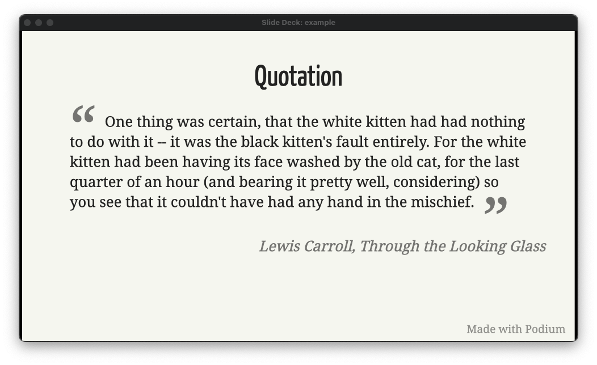

Quotations can also be included as bulleted content, formatted as follows:

```markdown
# Other inline content

* A quote in a bullet

    > To be, or not to be

    <cite>William Shakespeare</cite>
```

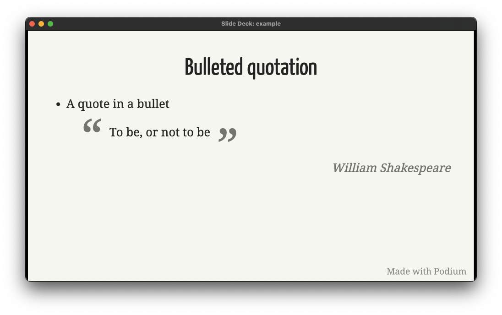

### Code

Inline code and codeblocks are supported.

Inline code is surrounded by single backticks. The following would render as a bullet with the word "inline" in code formatting.

```markdown
* A bullet with `inline` code formatting.
```

You can include codeblocks both at the top level and in bullet lists. Codeblocks are denoted by three backticks on the lines before and after the code, with the first line including the language being rendered.

To include a Python codeblock at the top level, you could include the following in your `slides.md`:

````markdown
```python
def greeting(arg):
    if arg == 'hello':
        print('Hello World')
    else:
        print(arg)


class Something():
    def __init__(self, *args, **kwargs):
        super().__init__(*args, **kwargs)
```
````

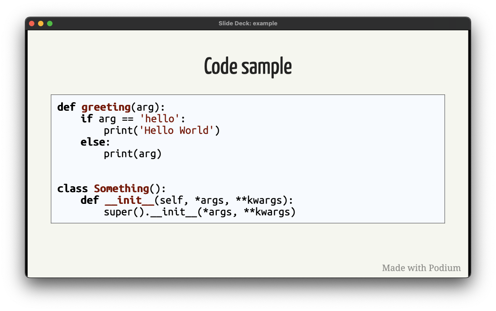

To include a Python codeblock in a bullet list, you could include the following:

````markdown
* Code in a bullet:

    ```python
    def greeting(arg):
      if arg == 'hello':
          print('Hello World')
    ```
````

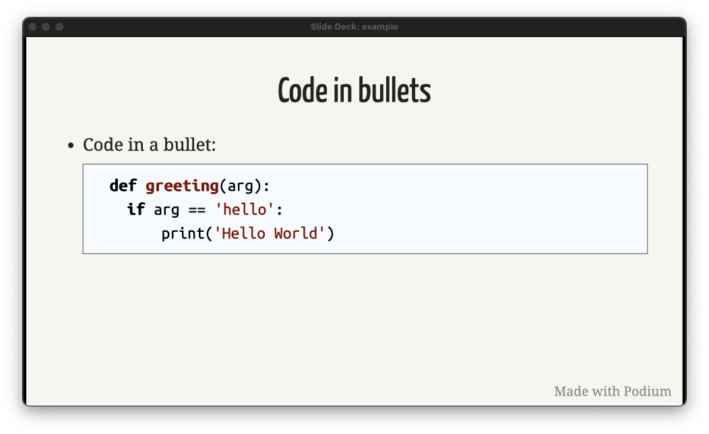

### Footnotes

You can include footnotes in your slides, formatted as follows:

```markdown
# Footnotes

* First thing.dag1[]

* Second thing.dag2[]

* Third thing.dag3[]

* Last thing.dag4[]

.footnotes[

.dag1[] This isn't exactly what it sounds like. You need to consider this very carefully. And I mean _really_ carefully

.dag2[] Second dagger

.dag3[] Third dagger

.dag4[] Fourth dagger

]
```

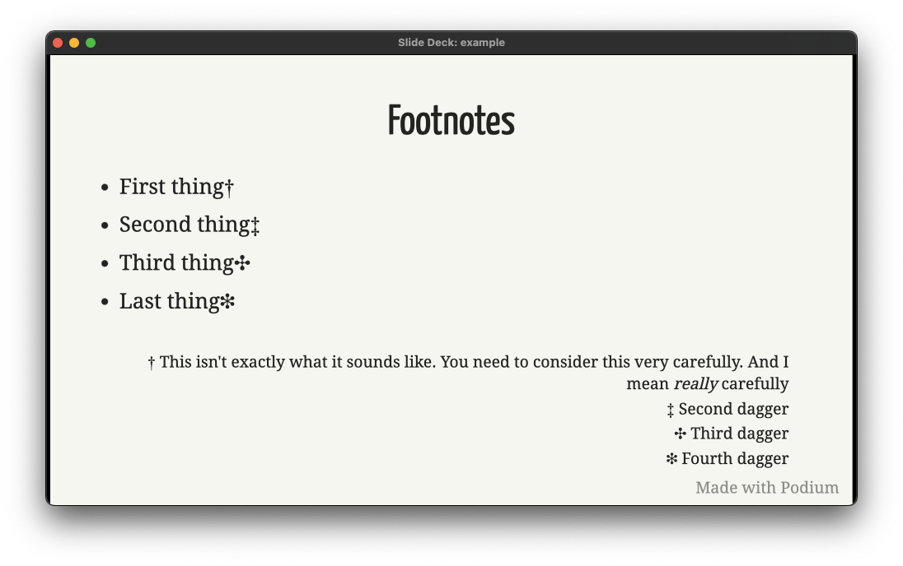

### Animated transitions

Podium supports a number of animated transitions.

Animated slides require the following class annotation, followed by the content:

```markdown
class: animated animationName

Content here.
```

Incoming transitions include:

- shake - Shakes content back and forth, left to right.
- tada - Zooms out slightly, and twists content back and forth.
- swing - Swings content left to right, like a pendulum connected from the top.
- wobble - Wobbles content left to right, like a pendulum connected from the bottom.
- pulse - Zooms in and out once.
- flash - Flashes between the current slide content and the previous slide content.
- bounce - Bounces content up and down.
- bounceIn - Bounces content back to front.
- bounceInUp - Bounces content up from the bottom of the slide.
- bounceInDown - Bounces content down from the top of the slide.
- bounceInLeft - Bounces content in from the left of the slide.
- bounceInRight - Bounces content in from the right of the slide.
- flip - Flips the content twice around a vertical axis.
- flipInX - Flips the content once around the x-axis, from top to bottom.
- flipInY - Flips the content once around the y-axis, from left to right.
- fadeIn - Fades previous slide content out and current slide content in.
- fadeInUp - Fades the current content up from the bottom of the slide.
- fadeInDown - Fades the current content down from the top of the slide.
- fadeInLeft - Fades the current content in from the left of the slide.
- fadeInRight - Fades the current content in from the right of the slide.
- rotateIn - Content begins upside down, and rotates around the z-axis from left to right, to become upright.
- rotateInUpLeft - Rotates content onto the slide from the bottom, as though attached to the bottom left corner.
- rotateInDownLeft - Rotates content onto the slide from the top, as though attached to the top left corner.
- rotateInUpRight - Rotates content onto the slide from the bottom, as though attached to the bottom right corner.
- rotateInDownRight - Rotates content onto the slide from the bottom, as though attached to the top right corner.
- rollIn - Rolls content in from the left of the slide.
- lightSpeedIn - Moves content quickly onto the slide, with momentum, from the right of the slide.

## Keyboard shortcuts

- CMD+Shift+P - Enter presentation mode; or, if in presentation mode, pause timer
- CMD+P - Open presentation in Print view
- CMD+Q - Quit Podium (exit presentation mode)
- CMD+Tab - Switch displays
- Right/Left arrows - Next/previous slide
- Home/End - first/last slide
- CMD+A - Switch aspect ratio between 16:9 and 4:3
- CMD+R - Reload slide deck
- CMD+T - Reset timer
