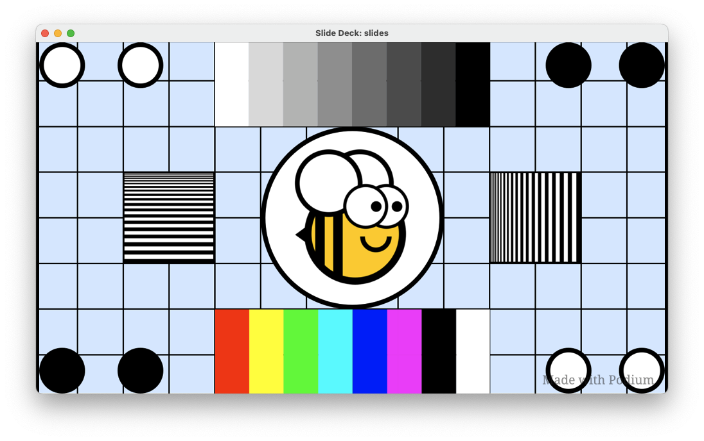
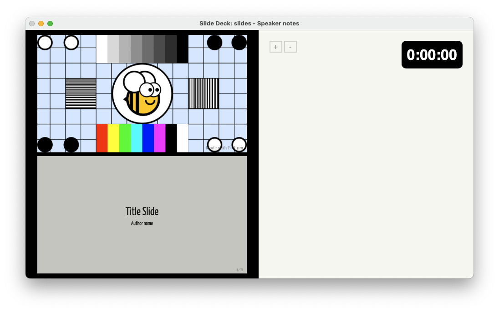

# Podium tutorial

This tutorial will get you started using Podium.

## Downloading Podium

The first step is to clone a copy of the Podium repository onto your computer.

Run the following commands:

```console
$ git clone https://github.com/beeware/podium.git
$ cd podium
```

This puts you in the `podium` directory. You are now ready to run Podium.

## Running Podium

The most straightforward way to run Podium, is using `uv`. You'll need to [install `uv`](https://docs.astral.sh/uv/getting-started/installation/) first.

Podium requires Python 3.12 or newer. You will need to have 3.12 or newer installed, and you will need to know which version within that requirement you are specifically using.

To open Podium, run the following:

```console
$ uvx -p 3.XX briefcase run
```

where `3.XX` is your version of Python. For example, if you have installed and are using Python 3.14, you would run the following:

```console
$ uvx -p 3.14 briefcase run
```

You will see something like the following:

```text
Installed 44 packages in 113ms
Evaluating dynamic project metadata... done

[podium] Starting app...
===========================================================================
Starting server...
Serving on 127.0.0.1:49856
```

The port number (the number after the colon on the `Serving on` line) will be different each time.

This will generate a file-open dialog.

## Opening the slide deck

In the dialog window, navigate to the `examples` directory and choose `example.podium`.

This opens two windows.

- The slide view window:



- The speaker view window:



You are now ready to begin editing the slides.

## Editing the slides

Open Finder, and navigate to the `examples` directory. Right-click on the `example.podium` bundle, and choose "Show Package Contents".


Within the `example.podium` bundle, you'll find the following files:

```text
example.podium/
├── slides.md
├── style.css
├── slides.htmls
├── screenshot.png
├── kitten.png
└── beeware.png
```

Open `slides.md` in your favorite Markdown editor. The example slide deck contains demos of pretty much everything Podium can do, including various formatting, incremental slide builds, code samples, and several animated transitions.
